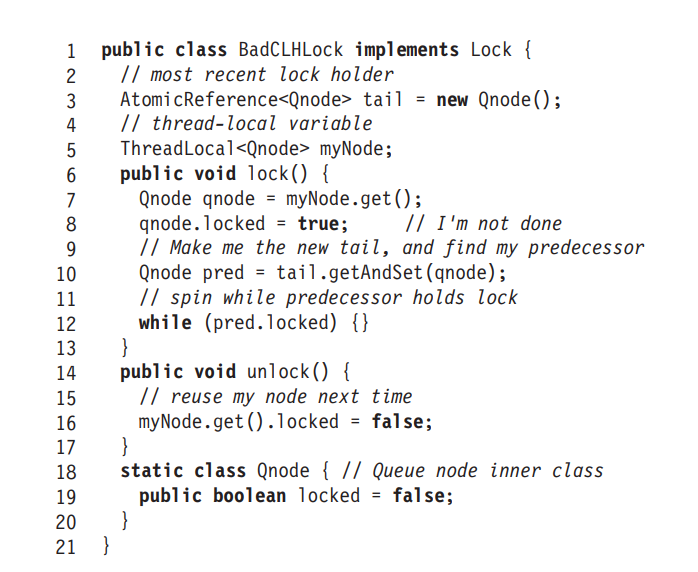

Код:



Представим ситуацию:

Поток А исполняет
```java
lock(); unlock(); lock();
```
никаких других взаимодействий одновременно с нашим `BadCLHLock` не происходит (включая иные потоки).
А также `lock` никем занят в текущий момент.

Первый `lock()` устанавливает `myNode.locked == true` и `tail == myNode`. 
Поскольку `lock` не занят, исполнение проходит через `while` на 12 строке.

`unlock()` устанавливает `myNode.locked == false`

Второй `lock()` также устанавливает `myNode.locked == true` и `tail == myNode`,
но в качестве `pred` получает `myNode`, так как она была поставлена в хвост в предыдущем вызове.
Так как `myNode.locked == true`, `pred.locked == true` также выполняется, а следовательно вызов `lock()` никогда не вернется,
а это, по определению, deadlock.

Кажется, deadlock подходит под `how this implementation can go wrong`.
